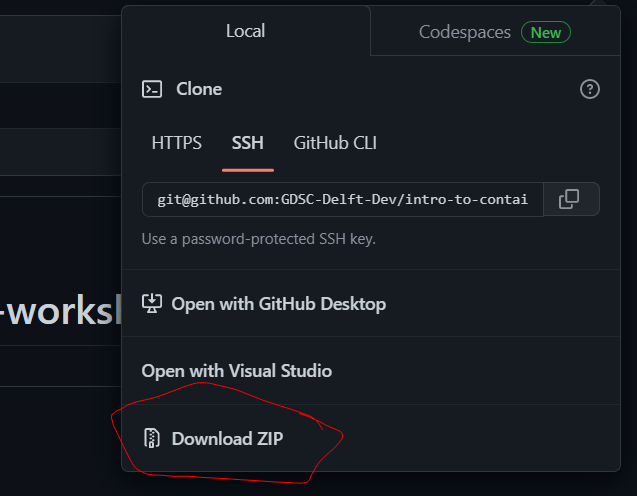

# Introduction to Containerisation Workshop 🐳📦🚢

This repository contains the materials for the Introduction to Containerisation Workshop by the [Google Developers Student Club (GDSC) Delft ](https://dscdelft.nl/). In this workshop, we will cover the basics of containerisation and demonstrate how containerize the REST API using Docker.

## Prerequisites

Before attending this workshop, you should have some basic understanding of Python and web development. You should also have Docker and Python (preferably version 3.9 and higher) installed on your machine. If you need help installing Docker, you can refer to the [official documentation](https://docs.docker.com/get-docker/).

## Getting Started

To get started, clone this repository to your local machine if you have `git` installed :

```shell
# HTTPS
$ git clone https://github.com/GDSC-Delft-Dev/intro-to-containerisation-workshop.git

# SSH
$ git clone git@github.com:GDSC-Delft-Dev/intro-to-containerisation-workshop.git
```

Otherwise, you can simply download the repository:



## The REST API

In this workshop, we will use a REST API built `Python` and [FastAPI](https://fastapi.tiangolo.com/). To get started, navigate to the `api` directory:

```shell
# Change directory to api
$ cd api
```

### Install Dependencies

Before we can run the application, we need to install the necessary dependencies. It is highly recommended to [create a virtual environment](#create-a-virtual-environment). To do this, we can use `pip`:

```shell
# install all dependencies from requirements.txt
$ pip install -r requirements.txt
```

### Create a virtual environment

Creating a virtual environment in Python is a recommended practice to isolate dependencies for different projects. By isolating dependencies, you can avoid conflicts between packages and ensure that your projects have all the necessary libraries installed. Here's a step-by-step guide to creating a virtual environment in Python:

1. Open a terminal window and navigate to the directory where you want to create the virtual environment.
2. Type the following command to create a new virtual environment:

```shell
# Creates a myenv virtual environment
$ python -m venv myenv
```

3. To activate the virtual environment, run the following command:

```shell
# Activate myenv on linux/Macos
$ source myenv/bin/activate

# Activate myenv on Windows
$ myenv\Scripts\activate
```

Once the virtual environment is activated, you will see the name of the environment in the command prompt.

```shell
# Linux
(venv) $

# Windows PowerShell
(venv) PS>
```

4. Now you can install the required packages for your project using `pip`.
5. To exit the virtual environment, run the following command:

```shell
deactivate
```

This will deactivate the virtual environment and return you to the original shell.

### Run the Application

Once the dependencies are installed, we can run the application using the following command:

```shell
# Run application
$ python main.py
```

This will start a local server that listens for incoming requests. You can test the application by sending requests to `http://localhost:5000` through your web browser, `curl`, Swagger documentation site at `http://localhost:5000/docs` (Highly recommended) or client tools like:

- [Postman](https://www.postman.com/)
- [Insomnia](https://insomnia.rest/)
- [Thunder Client](https://www.thunderclient.com/)

### Building the Docker Image

Left as and exercise for the reader 😉.

### Running the Docker Container

Left as and exercise for the reader 😉.

## Conclusion

Congratulations! You have successfully containerised a Python REST API using using Docker. We hope this workshop has given you a good introduction to containerisation and its benefits. If you have any questions or feedback, please don't hesitate to reach out.
